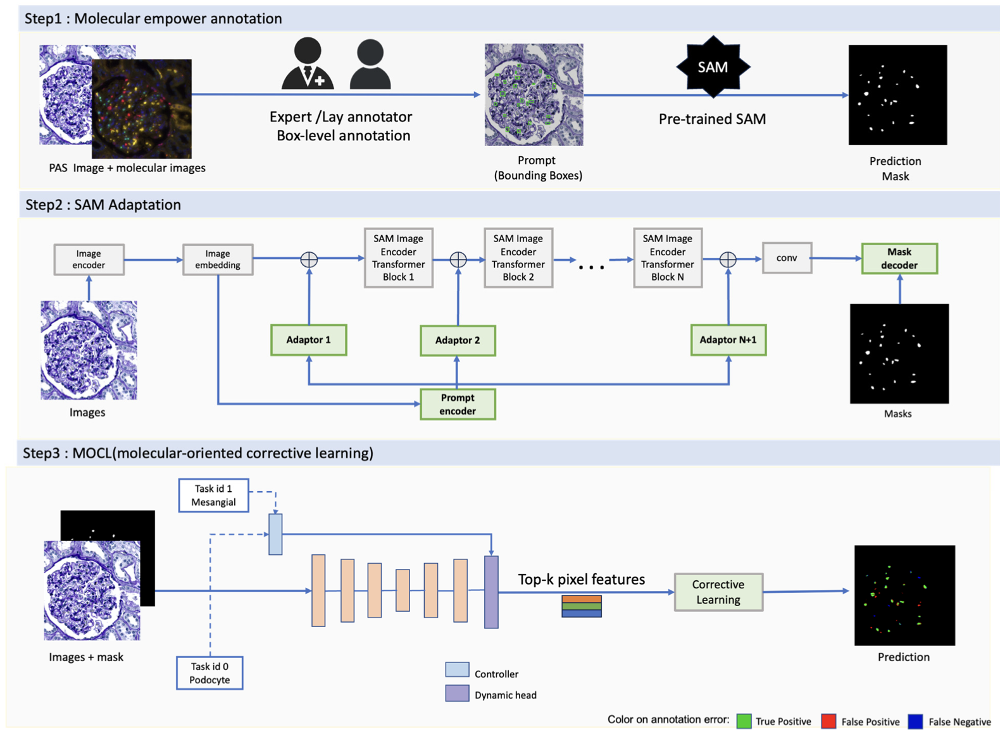

# Fine-grained Multi-class Nuclei Segmentation with Molecular-empowered All-in-SAM Model

<p align="center">
  
</p>


## Abstract

**Purpose:** Advances in Vision Foundation Models (VFMs), such as the **Segment Anything Model (SAM)**, have propelled the field of computational pathology. SAM offers versatile nuclei segmentation via prompt-based zero-shot methods or specialized SAM models. However, general VFMs often struggle with **fine-grained semantic segmentation**, such as differentiating nuclei subtypes or specific cell types.

**Approach:** We propose the **Molecular-empowered All-in-SAM Model**, a full-stack framework designed to enhance SAM’s capabilities for precise biomedical image analysis, featuring:

1. **Annotation** – Utilizes molecular-empowered learning with non-expert annotators to minimize dependence on detailed, pixel-level annotations.  
2. **Learning** – Employs lightweight SAM adapters to adapt the model for enhanced domain-specific semantic sensitivity while preserving generalizability.  
3. **Refinement** – Integrates **Molecular-Oriented Corrective Learning (MOCL)** to further refine segmentation accuracy.  

**Results:** Evaluations conducted on both internal and public datasets demonstrate substantial improvements in nuclei classification and segmentation performance—even under variable annotation quality.  

**Conclusions:** This framework significantly reduces the annotation burden, broadens access to high-quality pathology image analysis in resource-limited settings, and supports advancements in medical diagnostic automation.  

**Paper link:** [Fine-grained Multi-class Nuclei Segmentation with Molecular-empowered All-in-SAM Model (arXiv:2508.15751)](https://arxiv.org/abs/2508.15751)  
**Publication:** Accepted by *Journal of Medical Imaging*.  

---

## Installation

### Install Segment Anything
```bash
pip install git+https://github.com/facebookresearch/segment-anything.git
